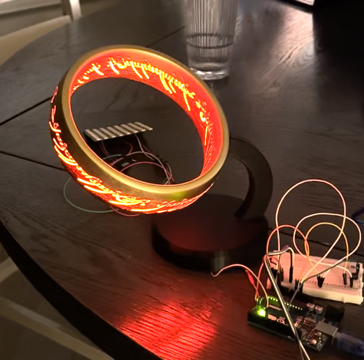
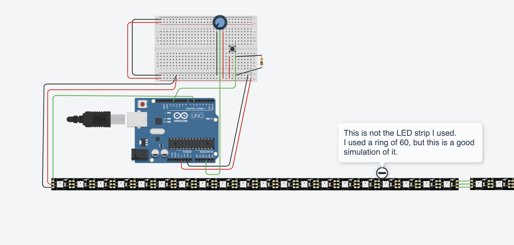

# One Lamp to Rule Them All

# The Code
The code supports a dimmer dial and a button for changing modes. Some of the modes were lifted from
the FastLED samples.

# The 3D Models

https://www.printables.com/model/436448-lord-of-the-rings-lamp

# The Circuit

# The Parts

- LEDs: https://www.amazon.com/dp/B0BVM3R2LN
- Arduino:
- Button:
- Potentiometer:
- PCP:
